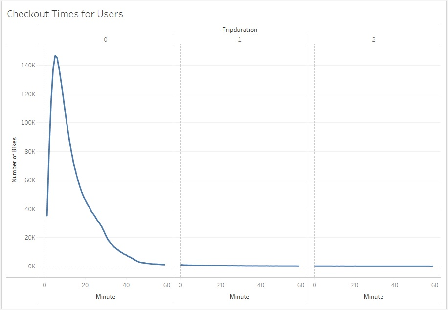
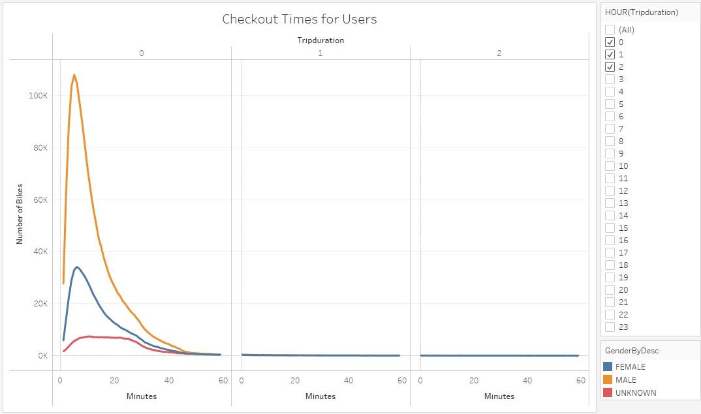
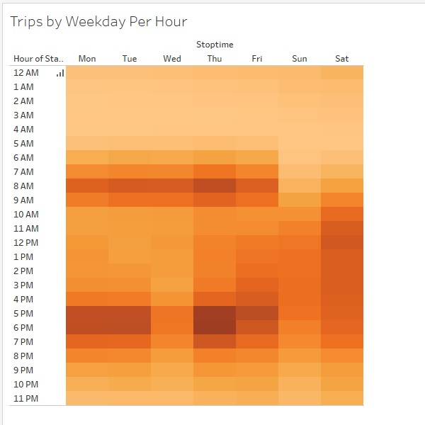
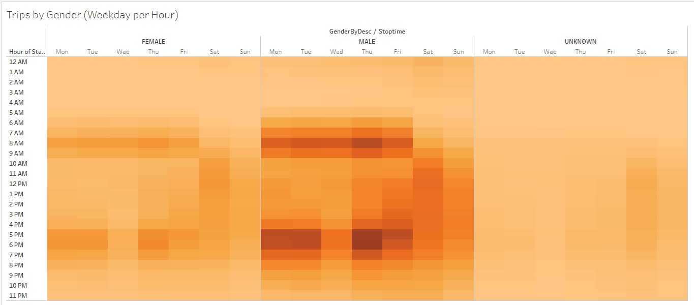
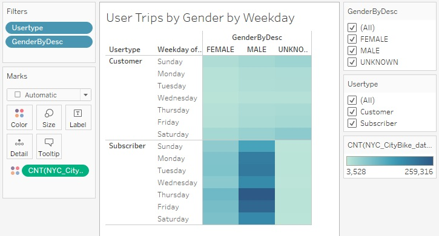
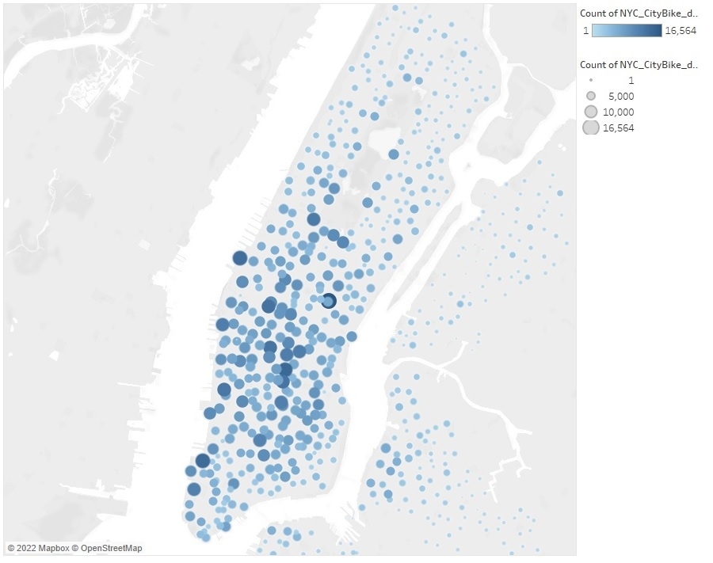
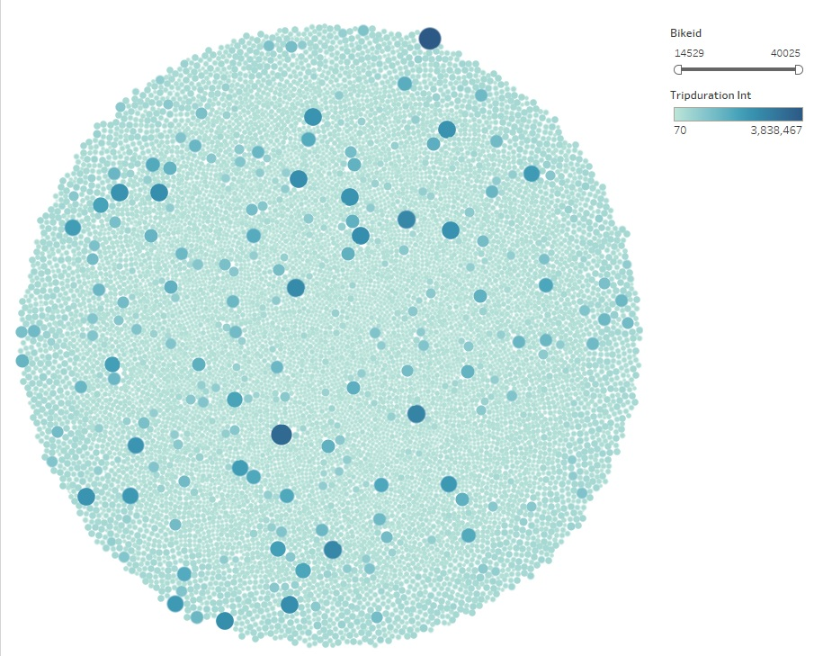

# NYC CitiBike
Module 15 Challenge - Data Visualization using Tableau

## Resources
Operating Platform: Windows 11 Pro - Build 22621 [Buy Windows 11 Pro](https://www.microsoft.com/en-us/d/windows-11-pro/dg7gmgf0d8h4?rtc=1)</br>
IDE Software: [Tableau Desktop](https://www.tableau.com/products/desktop/download) Build 2022.3.1 (20223.22.11.08.0821) 64-bit</br>
Source Data: [Historical 201908-citibike-tripdata](https://s3.amazonaws.com/tripdata/201908-citibike-tripdata.csv.zip)</br>
Resource files: [NYC Citibike Challenge](NYC_Citibike_Challenge.ipynb)</br>
Program Languages: Jupyter Notebook [Install](https://jupyter.org/install)</br>
Jupyter Packages: [Pandas](https://pandas.pydata.org/), [datetime](https://pandas.pydata.org/docs/user_guide/timeseries.html)

## Overview
Using historical data from a bikeshare company in NYC and their historical data, it will be used as a data sample to build a few visualizations using Tableau to help convince a fictious investors in Des Moines, Iowa  that creating their own BikeSharing company is a good idea. Using Tableau the following will be created to display: 
* The length of time that bikes are checked out for all riders and genders.
* The number of bike trips for all riders and genders for each hour of each day of the week.
* The number of bike trips for each type of user and gender for each day of the week.

## Deliverable 1: Change Trip Duration to a Datetime Format
Using Jupyter notebook the dataset is imported from a CSV file into a dataframe. The dataframe is then validated the information was imported correctly then using the below script the specific column is switched from int64 to datatime64. 
```
# 3. Convert the 'tripduration' column to datetime datatype.
citibike_df['tripduration'] = pd.to_datetime(citibike_df['tripduration'], unit='s')
```
The cleaned data is then exported to the file "NYC_CityBike_data_cleaned.csv". 
Note: Due to file size limitations a copy is not located on Github.com

[NYC_CitiBike_Challenge](/NYC_CitiBike_Challenge.ipynb)

## Deliverable 2: Create Visualizations for the Trip Analysis
Using Tableau, the following Visualizations were created to display:  
* How long bikes are checked out for all riders and genders.
* How many trips are taken by the hour for each day of the week, for all riders and genders.
* A breakdown of what days of the week a user might be more likely to check out a bike, by type of user and gender.

### Checkout Times for Users

This graph depicts the length of time (in hours) that the bikes are checked out for all riders. A bulk of the bikes are checked out for less than 1 hour with a much smaller percentage being checked out for greater than 2 hours. Because there is such a large trend for quick rentals it appears that the bikes are not being moved across town. Setting a good location of where the bikes are rentable will ensure they are constantly being used.

</br>

### Checkout Times by Gender
 
In this graph, the overwhelming majority of the bike checkouts are by males vs female and unknowns by at least 3 to 1. This information can be used to help target male customers and another focused marketing opportunity can be used to help attract more female rides into the business.

</br>

### Trips by Weekday for Each Hour

This is the first of several heatmaps used to display which times the bikes are used and the days which the heaviest usage occurs. Most of the usage comes from M - F during "commuter hours", between 6 AM and 9AM then again starting around 4PM to 7 to 8PM. The weekend times shift to more general tourist times, for Saturday the usage is between 9AM and 7PM and on Sunday the usage trickles down between 11AM to 5PM.

</br>

### Trips by Gender (Weekday per Hour)

This utilization heatmap displays a lower level of usage by female users vs Males. The timeframes are still the same with Mon - Fri usage during commuter hours and a little usage by females during the same timeframe. 

</br>

### User Types by Gender by Weekday

Using this heatmap breakdown of service subscribers vs non subscribers and gender can help marketing to help identify which groups might use the services the most. Usage for subscribers vs non customers is higher across the board with Males leading the most consistent usage vs females.

</br>

## Deliverable 3: Create a Story and Report for the Final Presentation

The created story using Tableau has a few slides, the first provides a map which details the starting trip locations for all the bikes in the current company. Most are centered around downtown NYC with a few of the other rides being spread out in other boroughs. This information can be extrapolated for the Des Moines area to determine where the largest supply of bikes should be allocated to. The denser the metropolitan area the largest the possibility of usage. 

</br>

The next slide shows the usage of each bike inside the bikeshare company. There are a few bikes which have a lot of usage whereas other bikes have less usage. This can be a large part of where the bikes tend to be used in which creates a higher amount of usage depending on starting and stop points. Knowing which bikes have the highest amount of usage can help with maintenance schedules along with ensuring the bike remains a part of the fleet.

</br>

The full Tablue file is located on their public site, you can view the Story by using the included [link](https://public.tableau.com/app/profile/jason.smith2061/viz/Mod15Challenge/Story1) 
